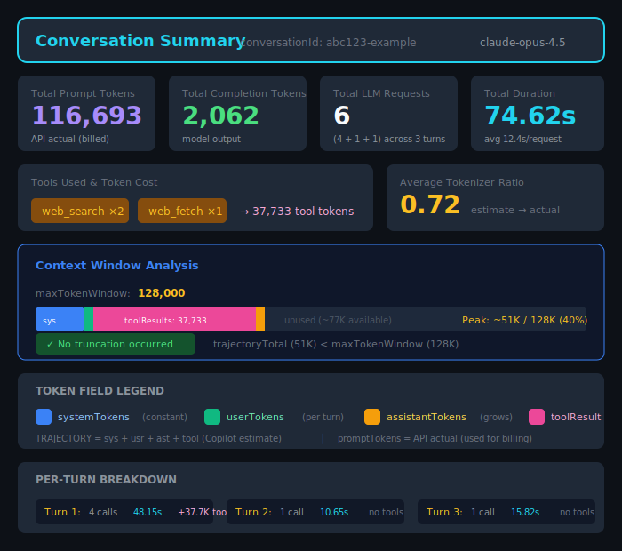
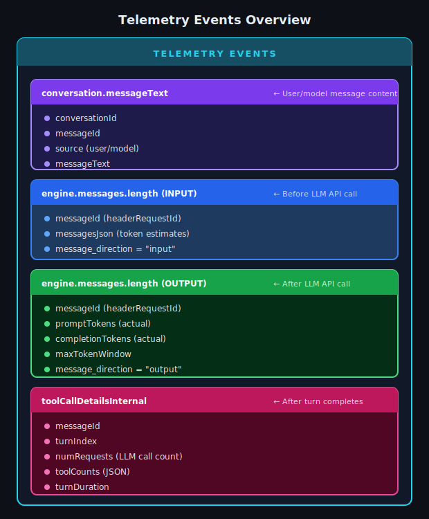
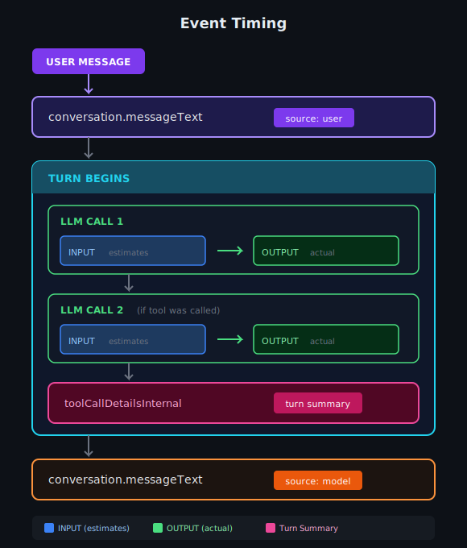

# Understanding Copilot Agent Mode Data Schema

This document explains the structure and composition of GitHub Copilot (VS Code) agent mode telemetry data.

**Related Document:** [Token Telemetry](./02_TOKEN_TELEMETRY.md) — Deep dive into token tracking and measurement

---

## 1. High-Level Conversation Hierarchy

A Copilot agent mode interaction follows a clear hierarchical structure. Understanding this hierarchy is the foundation for working with the telemetry data.


---

## 2. Hierarchy Levels Explained

| Level | ID Field | Description | Cardinality |
|-------|----------|-------------|-------------|
| **Conversation** | `conversationId` | The entire chat session | 1 per session |
| **Turn** | `messageId` | One user message + all model activity | 1+ per conversation |
| **LLM Call** | `callIndex` | Single request-response with LLM API | 1+ per turn |

### Key Relationships

```
1 Conversation  →  N Turns  →  M LLM Calls per Turn

Example:
┌─────────────────────────────────────────────────────────────────┐
│  Conversation: abc-123                                          │
│  ├── Turn 1 (messageId: msg-001)                                │
│  │   ├── LLM Call 1 (callIndex: 1) → Tool: read_file            │
│  │   ├── LLM Call 2 (callIndex: 2) → Tool: grep                 │
│  │   └── LLM Call 3 (callIndex: 3) → Final response             |
|  |                                                              |
│  ├── Turn 2 (messageId: msg-002)                                │
│  │   ├── LLM Call 1 (callIndex: 1) → Tool: write_file           │
│  │   └── LLM Call 2 (callIndex: 2) → Final response             |
|  |                                                              │
│  └── Turn 3 (messageId: msg-003)                                │
│      └── LLM Call 1 (callIndex: 1) → Final response (no tools)  │
└─────────────────────────────────────────────────────────────────┘
```

<p align="center">
  
</p>


---

## 3. Detailed Conversation Structure

<p align="center">
  
</p>

<p align="center">
  
</p>

### Why Multiple LLM Calls Per Turn?

When the model decides to use tools, each tool invocation triggers a new LLM call:


Each LLM call has its own:
- `promptTokens` — Tokens sent to the model
- `completionTokens` — Tokens in the model's response
- Tool invocation (optional)

---

## 4. Telemetry Events

The telemetry data comes from several event types, each capturing different aspects:

<p align="center">
  
</p>

### Event Types Overview


### Event Timing

<p align="center">
  
</p>


---

## 5. Data Completeness

### Complete vs Incomplete Conversations

A conversation is considered **complete** when:
1. `minTurnIndex == 1` — Starts at turn 1 (no missing start)
2. `capturedTurnCount == maxTurnIndex` — No gaps in turn sequence

```
COMPLETE CONVERSATION:
┌─────────────────────────────────────────┐
│  Turn 1 ✓                               │
│  Turn 2 ✓                               │
│  Turn 3 ✓                               │
│  maxTurnIndex = 3, capturedCount = 3    │
│  ──────────────────────────────────────│
│  COMPLETE ✓                             │
└─────────────────────────────────────────┘

INCOMPLETE CONVERSATION (missing start):
┌─────────────────────────────────────────┐
│  Turn 1 ✗ (missing)                     │
│  Turn 2 ✓                               │
│  Turn 3 ✓                               │
│  minTurnIndex = 2 (not 1!)              │
│  ──────────────────────────────────────│
│  INCOMPLETE ✗                           │
└─────────────────────────────────────────┘

INCOMPLETE CONVERSATION (gap):
┌─────────────────────────────────────────┐
│  Turn 1 ✓                               │
│  Turn 2 ✗ (missing)                     │
│  Turn 3 ✓                               │
│  maxTurnIndex = 3, capturedCount = 2    │
│  ──────────────────────────────────────│
│  INCOMPLETE ✗                           │
└─────────────────────────────────────────┘
```

### Trajectory Data Availability

Not all LLM calls have trajectory data (token breakdown). Check `hasTrajectory`:

```
┌─────────────────────────────────────────────────────────────────────┐
│  hasTrajectory = true                                                │
│  ─────────────────────                                               │
│  • INPUT event was captured                                          │
│  • messagesJson has token estimates                                  │
│  • systemTokens, userTokens, etc. are populated                     │
│                                                                      │
│  hasTrajectory = false                                               │
│  ──────────────────────                                              │
│  • INPUT event missing or messagesJson empty                        │
│  • All trajectory fields = 0                                         │
│  • Only promptTokens (from OUTPUT) is available                     │
│  • This is a TELEMETRY GAP, not a bug                               │
└─────────────────────────────────────────────────────────────────────┘
```

---

## 6. Stratified Sampling for SFT

Production queries use **stratified sampling** to ensure balanced representation across conversation lengths. Target: **~100,000 conversations** for SFT training.

### Bucket Definitions (Total: 100k)

```
┌─────────────────────────────────────────────────────────────────────────────────┐
│                          STRATIFIED BUCKETS                                      │
│                                                                                  │
│  ┌───────────────────────────────────────────────────────────────────────────┐  │
│  │  BUCKET: short_3_to_5_turns                                                │  │
│  │  ────────────────────────────────────────────────────────────────────────  │  │
│  │  Turn Range:  3-5 turns                                                    │  │
│  │  Sample Size: 40,000 conversations                                         │  │
│  │  Use Case:    Quick interactions, simple questions                         │  │
│  │                                                                            │  │
│  │  Example: "Fix this bug" → model reads file, edits, confirms              │  │
│  └───────────────────────────────────────────────────────────────────────────┘  │
│                                                                                  │
│  ┌───────────────────────────────────────────────────────────────────────────┐  │
│  │  BUCKET: medium_6_to_10_turns                                              │  │
│  │  ────────────────────────────────────────────────────────────────────────  │  │
│  │  Turn Range:  6-10 turns                                                   │  │
│  │  Sample Size: 40,000 conversations                                         │  │
│  │  Use Case:    Typical agentic tasks with follow-ups                        │  │
│  │                                                                            │  │
│  │  Example: "Implement feature X" → multiple iterations and refinements     │  │
│  └───────────────────────────────────────────────────────────────────────────┘  │
│                                                                                  │
│  ┌───────────────────────────────────────────────────────────────────────────┐  │
│  │  BUCKET: long_11_to_20_turns                                               │  │
│  │  ────────────────────────────────────────────────────────────────────────  │  │
│  │  Turn Range:  11-20 turns                                                  │  │
│  │  Sample Size: 20,000 conversations                                         │  │
│  │  Use Case:    Complex multi-step tasks, extended debugging sessions        │  │
│  │                                                                            │  │
│  │  Example: "Build entire module from scratch" → many files, iterations     │  │
│  └───────────────────────────────────────────────────────────────────────────┘  │
│                                                                                  │
└─────────────────────────────────────────────────────────────────────────────────┘
```

### Why Stratify?

Without stratification, random sampling would heavily favor short conversations (more common) and under-represent long conversations:

```
UNSTRATIFIED (random) sampling:
┌─────────────────────────────────────────────────────────────────────┐
│  Short (3-5):   ████████████████████████████████████  (~80%)       │
│  Medium (6-10): ████████                              (~15%)       │
│  Long (11-20):  ██                                    (~5%)        │
│                                                                      │
│  Problem: Long conversations under-represented!                      │
└─────────────────────────────────────────────────────────────────────┘

STRATIFIED sampling (Target: ~100k for SFT):
┌─────────────────────────────────────────────────────────────────────┐
│  Short (3-5):   ██████████████████████████████████████  40,000     │
│  Medium (6-10): ██████████████████████████████████████  40,000     │
│  Long (11-20):  ████████████████████████                20,000     │
│                                                                      │
│  Balanced representation across all conversation lengths            │
│  TOTAL: 100,000 conversations for SFT training                      │
└─────────────────────────────────────────────────────────────────────┘
```

### Sampling Flow

```
┌─────────────────────────────────────────────────────────────────────────────────┐
│                          STRATIFIED SAMPLING FLOW                                │
│                                                                                  │
│  ALL CONVERSATIONS (from telemetry)                                             │
│         │                                                                        │
│         ▼                                                                        │
│  ┌─────────────────────────────────────────────────────────────────────────┐   │
│  │  FILTER: Complete conversations only                                     │   │
│  │  • minTurnIndex == 1                                                     │   │
│  │  • capturedTurnCount == maxTurnIndex                                     │   │
│  └─────────────────────────────────────────────────────────────────────────┘   │
│         │                                                                        │
│         ▼                                                                        │
│  ┌─────────────────────────────────────────────────────────────────────────┐   │
│  │  ASSIGN BUCKET based on turn count                                       │   │
│  │  • 3-5 turns   → short_3_to_5_turns                                      │   │
│  │  • 6-10 turns  → medium_6_to_10_turns                                    │   │
│  │  • 11-20 turns → long_11_to_20_turns                                     │   │
│  │  • Others      → excluded                                                 │   │
│  └─────────────────────────────────────────────────────────────────────────┘   │
│         │                                                                        │
│         ├───────────────────┬───────────────────┬───────────────────┐           │
│         ▼                   ▼                   ▼                   │           │
│  ┌─────────────┐     ┌─────────────┐     ┌─────────────┐           │           │
│  │   SHORT     │     │   MEDIUM    │     │    LONG     │           │           │
│  │  sample     │     │   sample    │     │   sample    │           │           │
│  │   40,000    │     │   40,000    │     │   20,000    │           │           │
│  └─────────────┘     └─────────────┘     └─────────────┘           │           │
│         │                   │                   │                   │           │
│         └───────────────────┴───────────────────┘                   │           │
│                             │                                        │           │
│                             ▼                                        │           │
│                    ┌─────────────────┐                              │           │
│                    │ UNION: 100,000  │                              │           │
│                    │  conversations  │                              │           │
│                    └─────────────────┘                              │           │
│                                                                                  │
└─────────────────────────────────────────────────────────────────────────────────┘
```

---

## 7. Output Data Structure

### JSON Output Schema

```json
{
  "conversationId": "abc-123",
  "userName": "user@example.com",
  "bucket": "short_3_to_5_turns",
  "capturedTurnCount": 4,
  "minTurnIndex": 1,
  "maxTurnIndex": 4,
  "isComplete": true,
  "turns": [
    {
      "turnIndex": 1,
      "messageId": "msg-001",
      "userMessage": "Fix the bug in utils.ts",
      "modelMessage": "I've fixed the bug...",
      "llmCalls": [ /* see Token Telemetry doc */ ],
      "turnSummary": {
        "maxPromptTokens": 45000,
        "maxTrajectoryTotal": 38000,
        "maxTokenWindow": 127997,
        "hasTruncation": false,
        "hasTrajectory": true,
        "llmCallCount": 3
      },
      "toolCounts": "{\"read_file\":2,\"write_file\":1}",
      "numRequests": 3,
      "turnDurationMs": 15000
    }
  ]
}
```

---

## 8. Related Documents

| Document | Description |
|----------|-------------|
| [02_TOKEN_TELEMETRY.md](./02_TOKEN_TELEMETRY.md) | Deep dive into token tracking, trajectories, and truncation |
| [production/final/README.md](../../../production/final/README.md) | Production query documentation |

### Related Queries

| Query | Purpose |
|-------|---------|
| `production/final/sft_stratified_final.kql` | Stratified sampling with full token breakdown |
| `production/final/sft_simple_final.kql` | Lightweight extraction (no trajectory) |
| `production/final/sft_with_trajectory_final.kql` | Full per-call trajectory |

