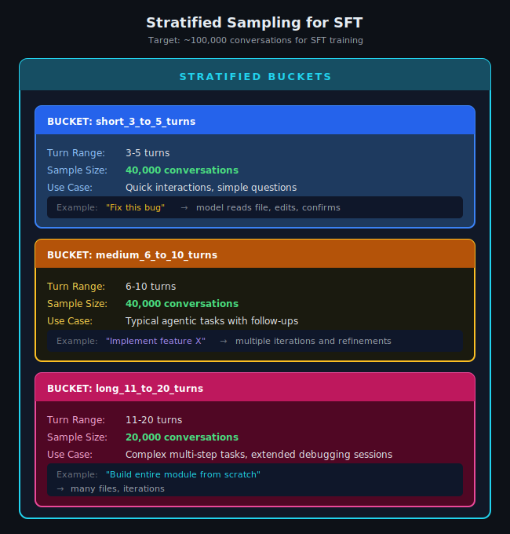
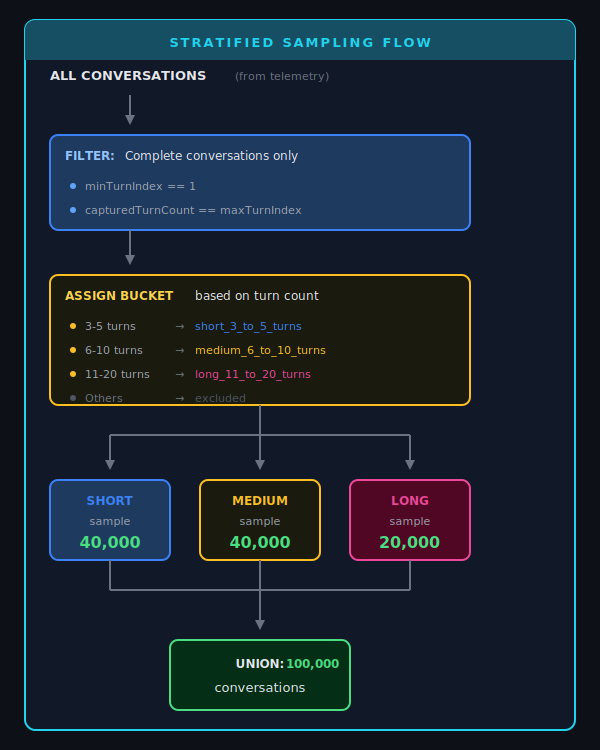

# Understanding Copilot Agent Mode Data Schema

This document explains the structure and composition of GitHub Copilot (VS Code) agent mode telemetry data.

**Related Documents:**
- [Token Telemetry](./02_TOKEN_TELEMETRY.md) — Deep dive into token tracking and measurement
- [Tool Telemetry](./03_TOOL_TELEMETRY.md) — Tool definitions, invocations, and turn end reasons

---

## 1. High-Level Conversation Hierarchy

A Copilot agent mode interaction follows a clear hierarchical structure. Understanding this hierarchy is the foundation for working with the telemetry data.


---

## 2. Hierarchy Levels Explained

| Level | ID Field | Description | Cardinality |
|-------|----------|-------------|-------------|
| **Conversation** | `conversationId` | The entire chat session | 1 per session |
| **Turn** | `messageId` | One user message + all model activity | 1+ per conversation |
| **LLM Call** | `callIndex` | Single request-response with LLM API | 1+ per turn |

### Key Relationships


<p align="center">
  
</p>


---

## 3. Detailed Conversation Structure

<!-- <p align="center">
  
</p> -->

<p align="center">
  
</p>

### Why Multiple LLM Calls Per Turn?

When the model decides to use tools, each tool invocation triggers a new LLM call:


Each LLM call has its own:
- `promptTokens` — Tokens sent to the model
- `completionTokens` — Tokens in the model's response
- Tool invocation (optional)

---

## 4. Telemetry Events

The telemetry data comes from several event types, each capturing different aspects:

<p align="center">
  
</p>

### Event Types Overview


### Event Timing

<p align="center">
  
</p>


---

## 5. Data Completeness

### Complete vs Incomplete Conversations

A conversation is considered **complete** when:
1. `minTurnIndex == 1` — Starts at turn 1 (no missing start)
2. `capturedTurnCount == maxTurnIndex` — No gaps in turn sequence

```
COMPLETE CONVERSATION:
┌─────────────────────────────────────────┐
│  Turn 1 ✓                               │
│  Turn 2 ✓                               │
│  Turn 3 ✓                               │
│  maxTurnIndex = 3, capturedCount = 3    │
│  ──────────────────────────────────────│
│  COMPLETE ✓                             │
└─────────────────────────────────────────┘

INCOMPLETE CONVERSATION (missing start):
┌─────────────────────────────────────────┐
│  Turn 1 ✗ (missing)                     │
│  Turn 2 ✓                               │
│  Turn 3 ✓                               │
│  minTurnIndex = 2 (not 1!)              │
│  ──────────────────────────────────────│
│  INCOMPLETE ✗                           │
└─────────────────────────────────────────┘

INCOMPLETE CONVERSATION (gap):
┌─────────────────────────────────────────┐
│  Turn 1 ✓                               │
│  Turn 2 ✗ (missing)                     │
│  Turn 3 ✓                               │
│  maxTurnIndex = 3, capturedCount = 2    │
│  ──────────────────────────────────────│
│  INCOMPLETE ✗                           │
└─────────────────────────────────────────┘
```

### Trajectory Data Availability

Not all LLM calls have trajectory data (token breakdown). Check `hasTrajectory`:

```
┌─────────────────────────────────────────────────────────────────────┐
│  hasTrajectory = true                                                │
│  ─────────────────────                                               │
│  • INPUT event was captured                                          │
│  • messagesJson has token estimates                                  │
│  • systemTokens, userTokens, etc. are populated                     │
│                                                                      │
│  hasTrajectory = false                                               │
│  ──────────────────────                                              │
│  • INPUT event missing or messagesJson empty                        │
│  • All trajectory fields = 0                                         │
│  • Only promptTokens (from OUTPUT) is available                     │
│  • This is a TELEMETRY GAP, not a bug                               │
└─────────────────────────────────────────────────────────────────────┘
```

---

## 6. Stratified Sampling for SFT

Production queries use **stratified sampling** to ensure balanced representation across conversation lengths. Target: **~100,000 conversations** for SFT training.

<p align="center">
  
</p>

### Bucket Definitions

| Bucket | Turn Range | Sample Size | Use Case |
|--------|------------|-------------|----------|
| `short_3_to_5_turns` | 3-5 turns | 40,000 | Quick interactions, simple questions |
| `medium_6_to_10_turns` | 6-10 turns | 40,000 | Typical agentic tasks with follow-ups |
| `long_11_to_20_turns` | 11-20 turns | 20,000 | Complex multi-step tasks, extended debugging |

**Total: 100,000 conversations**

### Why Stratify?

Without stratification, random sampling would heavily favor short conversations (more common) and under-represent long conversations. Stratified sampling ensures balanced representation across all conversation lengths for effective SFT training.

### Sampling Flow

<p align="center">
  
</p>

1. **Filter:** Complete conversations only (`minTurnIndex == 1` and `capturedTurnCount == maxTurnIndex`)
2. **Assign Bucket:** Based on turn count (3-5, 6-10, 11-20)
3. **Sample:** Take target count from each bucket
4. **Union:** Combine all buckets → 100,000 conversations

---

## 7. Output Data Structure

### JSON Output Schema

```json
{
  "conversationId": "abc-123",
  "userName": "user@example.com",
  "bucket": "short_3_to_5_turns",
  "capturedTurnCount": 4,
  "minTurnIndex": 1,
  "maxTurnIndex": 4,
  "isComplete": true,
  "turns": [
    {
      "turnIndex": 1,
      "messageId": "msg-001",
      "userMessage": "Fix the bug in utils.ts",
      "modelMessage": "I've fixed the bug...",
      "llmCalls": [ /* see Token Telemetry doc */ ],
      "turnSummary": {
        "maxPromptTokens": 45000,
        "maxTrajectoryTotal": 38000,
        "maxTokenWindow": 127997,
        "hasTruncation": false,
        "hasTrajectory": true,
        "llmCallCount": 3
      },
      "toolCounts": "{\"read_file\":2,\"write_file\":1}",
      "numRequests": 3,
      "turnDurationMs": 15000
    }
  ]
}
```

---

## 8. Available Tools Telemetry

### Where `availableTools` Comes From

**Source:** `toolCallDetailsInternal` event (NOT `virtualTools.toolset`)

| Event | Has messageId? | Use For |
|-------|----------------|---------|
| `toolCallDetailsInternal` | ✅ Yes | `availableTools`, `availableToolCount`, `toolCounts` |
| `virtualTools.toolset` | ❌ No | Tool group definitions only (no join key) |

### `availableTools` Behavior

```
┌─────────────────────────────────────────────────────────────────────────────┐
│                  availableTools WITHIN A CONVERSATION                        │
├─────────────────────────────────────────────────────────────────────────────┤
│                                                                             │
│  Turn 1: availableToolCount = 77                                            │
│    └── LLM Call 1: 77 tools                                                 │
│    └── LLM Call 2: 77 tools  ← CONSTANT within turn                        │
│                                                                             │
│  Turn 2: availableToolCount = 84  ← CAN CHANGE between turns               │
│    └── LLM Call 1: 84 tools                                                 │
│    └── LLM Call 2: 84 tools                                                 │
│                                                                             │
│  NOTE: User may enable MCP tools mid-conversation                          │
│                                                                             │
└─────────────────────────────────────────────────────────────────────────────┘
```

**Key Points:**
- `availableTools` is **CONSTANT within a turn** (across all llmCalls)
- `availableTools` **CAN CHANGE between turns** (user enables/disables extensions)
- Stored as JSON array: `["create_file","read_file","grep_search",...]`

### Fields NOT Available in This Cluster

| Field | Status | Alternative |
|-------|--------|-------------|
| `maxTokenWindow` | ❌ Not in Measurements | N/A - context limits not tracked |

---

## 9. Related Documents

| Document | Description |
|----------|-------------|
| [02_TOKEN_TELEMETRY.md](./02_TOKEN_TELEMETRY.md) | Deep dive into token tracking, trajectories, and truncation |
| [production/final/README.md](../../../production/final/README.md) | Production query documentation |

### Related Queries

| Query | Purpose |
|-------|---------|
| `production/final/sft_stratified_final.kql` | Stratified sampling with full token breakdown |
| `production/final/sft_simple_final.kql` | Lightweight extraction (no trajectory) |
| `production/final/sft_with_trajectory_final.kql` | Full per-call trajectory |

