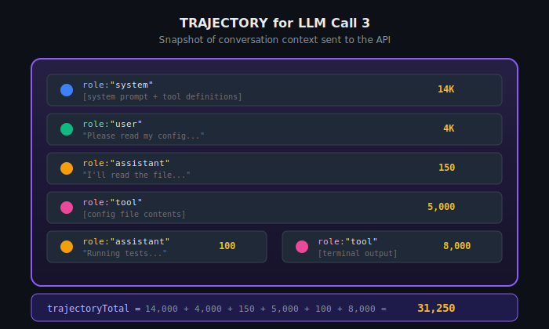
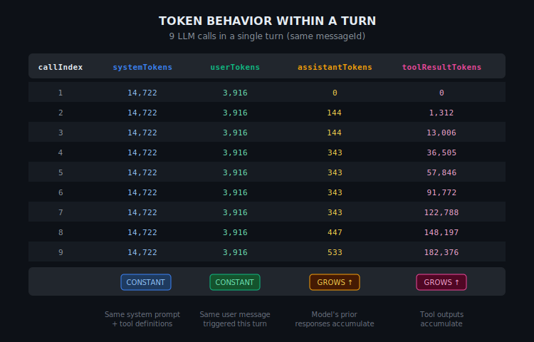
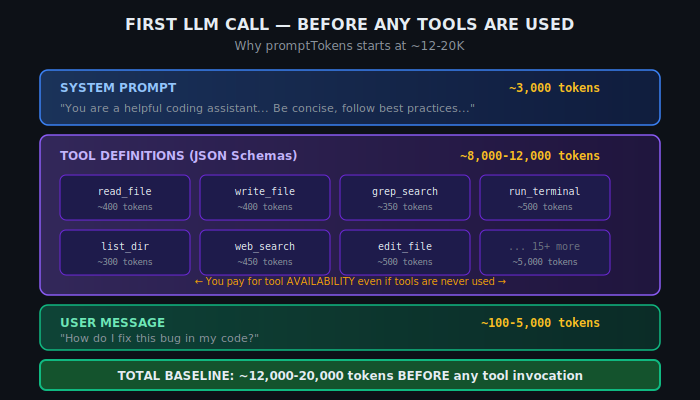
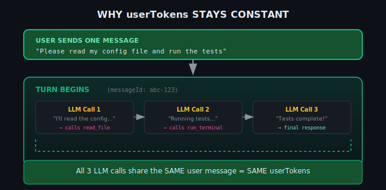
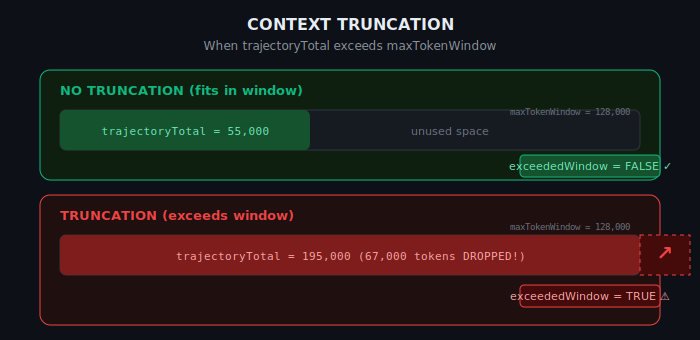
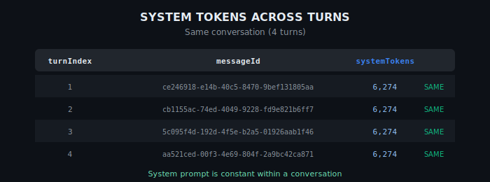

# Understanding Copilot Agent Mode Token Telemetry

This document explains how tokens are tracked and measured in GitHub Copilot (VS Code) agent mode telemetry.

**Related Document:** [Data Schema](./01_DATA_SCHEMA.md) — Understanding conversation structure and data composition

**Related Queries:**
- `exploration/token_mechanics/49_single_turn_with_truncation.kql` — Full token breakdown with truncation detection
- `exploration/token_mechanics/50_verify_system_across_turns.kql` — Verify system tokens across turns
- `exploration/token_mechanics/51_verify_system_across_conversations.kql` — Verify system tokens across conversations

---

## 1. Token Data Flow

Copilot telemetry captures two distinct perspectives on token usage:
- **Estimates** computed client-side before the API call
- **Actuals** returned by the LLM after processing

<p align="center">
  
</p>

```
┌─────────────────────────────────────────────────────────────────────────────────┐
│                         TOKEN DATA FLOW                                          │
│                                                                                  │
│  ┌─────────────────────────────┐              ┌─────────────────────────────┐   │
│  │  COPILOT CLIENT (INPUT)     │              │  LLM API (OUTPUT)           │   │
│  │  ═══════════════════════    │              │  ═══════════════════════    │   │
│  │                             │   ───────▶   │                             │   │
│  │  ESTIMATES:                 │   API Call   │  ACTUALS:                   │   │
│  │  • systemTokens             │              │  • promptTokens             │   │
│  │  • userTokens               │              │  • completionTokens         │   │
│  │  • assistantTokens          │              │  • maxTokenWindow           │   │
│  │  • toolResultTokens         │              │                             │   │
│  │  • trajectoryTotal          │              │                             │   │
│  │                             │              │                             │   │
│  │  Fast client tokenizer      │              │  Model's actual tokenizer   │   │
│  │  (for truncation decisions) │              │  (for billing/limits)       │   │
│  └─────────────────────────────┘              └─────────────────────────────┘   │
│                                                                                  │
└─────────────────────────────────────────────────────────────────────────────────┘
```

### Token Fields Reference

| Field | Source | Direction | Description |
|-------|--------|-----------|-------------|
| `promptTokens` | LLM API | OUTPUT | **Actual** tokens charged — use for cost analysis |
| `completionTokens` | LLM API | OUTPUT | **Actual** response tokens from the model |
| `maxTokenWindow` | Model config | OUTPUT | Maximum context window for the model |
| `trajectoryTotal` | Copilot | INPUT | Sum of all role token estimates |
| `systemTokens` | Copilot | INPUT | System prompt + tool definitions |
| `userTokens` | Copilot | INPUT | User's message tokens |
| `assistantTokens` | Copilot | INPUT | Model's previous responses in context |
| `toolResultTokens` | Copilot | INPUT | Tool output tokens accumulated so far |
| `exceededWindow` | Calculated | — | `trajectoryTotal > maxTokenWindow` (truncation flag) |
| `tokenizerRatio` | Calculated | — | `promptTokens / trajectoryTotal` (tokenizer difference) |

---

## 2. What is a "Trajectory"?

A **trajectory** is the complete list of messages sent to the LLM at a given moment — a snapshot of the conversation context for each API call.

<p align="center">
  
</p>

```
┌─────────────────────────────────────────────────────────────────────────────────┐
│  TRAJECTORY for LLM Call 3                                                       │
│  ═══════════════════════════                                                     │
│                                                                                  │
│  [                                                                               │
│    {"role": "system",    "content": "[system prompt + tool defs]"},  14K        │
│    {"role": "user",      "content": "Please read my config..."},      4K        │
│    {"role": "assistant", "content": "I'll read the file..."},        150        │
│    {"role": "tool",      "content": "[config file contents]"},      5000        │
│    {"role": "assistant", "content": "Running tests..."},             100        │
│    {"role": "tool",      "content": "[terminal output]"},           8000        │
│  ]                                                                               │
│                                                                                  │
│  trajectoryTotal = 14,000 + 4,000 + 150 + 5,000 + 100 + 8,000 = 31,250          │
│                                                                                  │
└─────────────────────────────────────────────────────────────────────────────────┘
```

### The `hasTrajectory` Flag

| Value | Meaning |
|-------|---------|
| `hasTrajectory = true` | The INPUT telemetry event was captured with `messagesJson` populated. We can see the role breakdown. |
| `hasTrajectory = false` | The INPUT event is missing or `messagesJson` is empty. Telemetry gap — we only have `promptTokens` from OUTPUT. |

---

## 3. Token Behavior Within a Turn

Within a single turn (same `messageId`), some fields remain **constant** while others **grow** as tools are invoked.

<p align="center">
  
</p>

### Summary Table

| Field | Behavior | Why |
|-------|----------|-----|
| `systemTokens` | **CONSTANT** | Same system prompt + tool definitions for all calls |
| `userTokens` | **CONSTANT** | Same user message triggered all calls in this turn |
| `assistantTokens` | **GROWS** | Model's intermediate responses accumulate |
| `toolResultTokens` | **GROWS** | Tool outputs accumulate with each tool call |

### Real Data Example

```
┌──────────┬──────────────┬────────────┬─────────────────┬──────────────────┐
│callIndex │ systemTokens │ userTokens │ assistantTokens │ toolResultTokens │
├──────────┼──────────────┼────────────┼─────────────────┼──────────────────┤
│    1     │    14,722    │   3,916    │        0        │        0         │
│    2     │    14,722    │   3,916    │      144        │     1,312        │
│    3     │    14,722    │   3,916    │      144        │    13,006        │
│    4     │    14,722    │   3,916    │      343        │    36,505        │
│    5     │    14,722    │   3,916    │      343        │    57,846        │
│    6     │    14,722    │   3,916    │      343        │    91,772        │
│    7     │    14,722    │   3,916    │      343        │   122,788        │
│    8     │    14,722    │   3,916    │      447        │   148,197        │
│    9     │    14,722    │   3,916    │      533        │   182,376        │
└──────────┴──────────────┴────────────┴─────────────────┴──────────────────┘
              CONSTANT       CONSTANT       GROWS            GROWS
```

**Query:** Run `49_single_turn_with_truncation.kql` to observe this pattern in your data.

---

## 4. Why `promptTokens` Seems Inflated at First Glance

### The Question
> "Why is `promptTokens` already 25,000 for the very first message in a conversation?"

### The Answer: Tool Definitions Are Always Included

<p align="center">
  
</p>

Even before ANY tool is invoked, the first LLM call already has ~15-25K tokens because **tool definitions are part of the system message**:

```
┌─────────────────────────────────────────────────────────────────────────────────┐
│  FIRST LLM CALL — BEFORE ANY TOOLS ARE USED                                      │
│                                                                                  │
│  ┌─────────────────────────────────────────────────────────────────────────┐    │
│  │  SYSTEM PROMPT                                             ~3,000 tokens │    │
│  │  "You are a helpful coding assistant..."                                 │    │
│  └─────────────────────────────────────────────────────────────────────────┘    │
│                                                                                  │
│  ┌─────────────────────────────────────────────────────────────────────────┐    │
│  │  TOOL DEFINITIONS (JSON Schemas)                    ~8,000-12,000 tokens │    │
│  │                                                                          │    │
│  │  ┌──────────────┐ ┌──────────────┐ ┌──────────────┐ ┌──────────────┐   │    │
│  │  │  read_file   │ │  write_file  │ │ grep_search  │ │ run_terminal │   │    │
│  │  │  ~400 tokens │ │  ~400 tokens │ │  ~350 tokens │ │  ~500 tokens │   │    │
│  │  └──────────────┘ └──────────────┘ └──────────────┘ └──────────────┘   │    │
│  │                                                                          │    │
│  │  ← You pay for tool AVAILABILITY even if tools are never used →         │    │
│  └─────────────────────────────────────────────────────────────────────────┘    │
│                                                                                  │
│  ┌─────────────────────────────────────────────────────────────────────────┐    │
│  │  USER MESSAGE                                          ~100-5,000 tokens │    │
│  │  "How do I fix this bug?"                                                │    │
│  └─────────────────────────────────────────────────────────────────────────┘    │
│                                                                                  │
│  TOTAL BASELINE: ~12,000-20,000 tokens BEFORE any tool invocation               │
│                                                                                  │
└─────────────────────────────────────────────────────────────────────────────────┘
```

| Component | Token Count |
|-----------|-------------|
| System Prompt | ~3,000 tokens |
| Tool Definitions (JSON Schemas) | ~8,000-12,000 tokens |
| User Message | ~100-5,000 tokens |
| **TOTAL BASELINE** | **~12,000-20,000 tokens** |

### Key Insight: Tool Availability ≠ Tool Invocation

| Tool Definitions (always sent) | Tool Results (only when used) |
|-------------------------------|-------------------------------|
| Cost: ~8-12K tokens | Cost: Variable (0-200K+) |
| When: EVERY LLM call | When: After tool is invoked |
| Purpose: LLM needs this to know tools exist | Purpose: LLM needs this to see results |

---

## 5. Why `userTokens` is Constant Across LLM Calls

All LLM calls within a turn share the same `messageId` because they were triggered by **one user message**.

<p align="center">
  
</p>

```
┌─────────────────────────────────────────────────────────────────────────────────┐
│  USER SENDS ONE MESSAGE                                                          │
│                                                                                  │
│  "Please read my config file and run the tests"                                 │
│                              │                                                   │
│                              ▼                                                   │
│  ┌─────────────────────────────────────────────────────────────────────────┐   │
│  │  TURN BEGINS (messageId: abc-123)                                        │   │
│  │                                                                          │   │
│  │  LLM Call 1: "I'll read the config file..." → calls read_file           │   │
│  │  LLM Call 2: "I see the config. Running tests..." → calls run_terminal  │   │
│  │  LLM Call 3: "Tests complete! Here are results..." → final response     │   │
│  │                                                                          │   │
│  └─────────────────────────────────────────────────────────────────────────┘   │
│                                                                                  │
│  All 3 LLM calls share the SAME user message = SAME userTokens                  │
│                                                                                  │
└─────────────────────────────────────────────────────────────────────────────────┘
```

The user sent one request; the model makes multiple calls to fulfill it. Each call includes the same user message.

---

## 6. Copilot Estimates vs Actual API Tokens

Copilot uses a fast client-side tokenizer to estimate counts for truncation decisions. The LLM uses its own tokenizer, which produces different counts.

<p align="center">
  
</p>

### Why the Difference?

The same text tokenizes differently depending on the algorithm:

```
┌─────────────────────────────────────────────────────────────────────────────────┐
│  SAME TEXT, DIFFERENT TOKENIZERS                                                 │
│                                                                                  │
│  Text: "Hello, how are you doing today?"                                        │
│                                                                                  │
│  ┌─────────────────────────┐    ┌─────────────────────────┐                     │
│  │  Copilot's Tokenizer    │    │  Claude's Tokenizer     │                     │
│  │  ───────────────────────│    │  ───────────────────────│                     │
│  │  "Hello" → 1 token      │    │  "Hello," → 1 token     │                     │
│  │  "," → 1 token          │    │  " how" → 1 token       │                     │
│  │  " how" → 1 token       │    │  " are you" → 1 token   │                     │
│  │  " are" → 1 token       │    │  " doing" → 1 token     │                     │
│  │  " you" → 1 token       │    │  " today?" → 1 token    │                     │
│  │  " doing" → 1 token     │    │                         │                     │
│  │  " today" → 1 token     │    │  TOTAL: 5 tokens        │                     │
│  │  "?" → 1 token          │    │                         │                     │
│  │                         │    │                         │                     │
│  │  TOTAL: 8 tokens        │    │                         │                     │
│  └─────────────────────────┘    └─────────────────────────┘                     │
│                                                                                  │
│  tokenizerRatio = 5/8 = 0.625 (Claude counted 63% of Copilot's estimate)        │
│                                                                                  │
└─────────────────────────────────────────────────────────────────────────────────┘
```

**Important:** A large difference between `trajectoryTotal` and `promptTokens` does NOT indicate truncation — it reflects tokenizer mismatch. Use `exceededWindow` to detect truncation.

---

## 7. Context Truncation

### When Does Truncation Occur?

Truncation happens when `trajectoryTotal > maxTokenWindow`. Copilot drops older messages to fit within the model's context limit.

<p align="center">
  
</p>

```
┌─────────────────────────────────────────────────────────────────────────────────┐
│  NO TRUNCATION (fits in window)                                                  │
│  ──────────────────────────────                                                  │
│  maxTokenWindow = 128,000                                                        │
│  ┌─────────────────────────────────────────────────────────────────────────┐    │
│  │░░░░░░░░░░░░░░░░░░░░░░░░░░░░░░░░░░░░░░░░│                               │    │
│  │ trajectoryTotal = 55,000               │       unused space            │    │
│  └─────────────────────────────────────────────────────────────────────────┘    │
│  exceededWindow = FALSE ✓                                                        │
│                                                                                  │
├──────────────────────────────────────────────────────────────────────────────────┤
│  TRUNCATION (exceeds window)                                                     │
│  ───────────────────────────                                                     │
│  maxTokenWindow = 128,000                                                        │
│  ┌─────────────────────────────────────────────────────────────────────────┐    │
│  │████████████████████████████████████████████████████████████████████████│    │
│  │ trajectoryTotal = 195,000 (67,000 tokens DROPPED!)                      │    │
│  └─────────────────────────────────────────────────────────────────────────┘    │
│  exceededWindow = TRUE ⚠️                                                        │
│                                                                                  │
└─────────────────────────────────────────────────────────────────────────────────┘
```

### Detecting Truncation Correctly

| Method | Reliability |
|--------|-------------|
| ✅ `exceededWindow = trajectoryTotal > maxTokenWindow` | **CORRECT** — This is the only reliable indicator |
| ❌ `truncationDelta = trajectoryTotal - promptTokens` | **WRONG** — This measures tokenizer difference, not truncation |

### Real Example

```
trajectoryTotal = 110,753
maxTokenWindow  = 127,997
promptTokens    =  51,741

truncationDelta = 59,012  ← Large number, but NOT truncation!

110,753 < 127,997 → Context FIT in window
exceededWindow = FALSE → NO TRUNCATION

The 59K delta is tokenizer mismatch, not dropped content.
```

### What Gets Dropped?

<p align="center">
  
</p>

```
┌─────────────────────────────────────────────────────────────────────────────────┐
│  TRUNCATION PRIORITY                                                             │
│                                                                                  │
│  ┌────────────────────────────┐    ┌────────────────────────────────────────┐   │
│  │ DROPPED FIRST:             │    │ KEPT (highest priority):               │   │
│  │ ──────────────             │    │ ────────────────────────               │   │
│  │                            │    │                                         │   │
│  │ 1. Oldest turn tool        │    │ 1. System prompt (ALWAYS kept)         │   │
│  │    results                 │    │                                         │   │
│  │                            │    │ 2. Current user message                │   │
│  │ 2. Oldest turn assistant   │    │                                         │   │
│  │    responses               │    │ 3. Recent tool results                 │   │
│  │                            │    │                                         │   │
│  │ 3. Earlier content in      │    │ 4. Recent assistant responses          │   │
│  │    current turn            │    │                                         │   │
│  │                            │    │ (Most recent content preserved)        │   │
│  └────────────────────────────┘    └────────────────────────────────────────┘   │
│                                                                                  │
└─────────────────────────────────────────────────────────────────────────────────┘
```

Truncation removes content in order of age:
1. **Oldest turns first** (previous conversation history)
2. **Earlier content within current turn** (if turn is very long)
3. **System prompt is ALWAYS preserved**

---

## 8. System Tokens Behavior

### Across Turns (Same Conversation)

`systemTokens` remains **constant** within a conversation — the same system prompt and tool definitions are used throughout.

<p align="center">
  
</p>

```
┌─────────────────────────────────────────────────────────────────────────────────┐
│  SAME CONVERSATION (4 turns)                                                     │
│                                                                                  │
│  turnIndex │ messageId                              │ systemTokens │            │
│  ══════════╪════════════════════════════════════════╪══════════════╪════════════│
│      1     │ ce246918-e14b-40c5-8470-9bef131805aa   │    6,274     │  SAME      │
│      2     │ cb1155ac-74ed-4049-9228-fd9e821b6ff7   │    6,274     │  SAME      │
│      3     │ 5c095f4d-192d-4f5e-b2a5-01926aab1f46   │    6,274     │  SAME      │
│      4     │ aa521ced-00f3-4e69-804f-2a9bc42ca871   │    6,274     │  SAME      │
│                                                                                  │
│  System prompt is constant within a conversation!                               │
└─────────────────────────────────────────────────────────────────────────────────┘
```

**Query:** `50_verify_system_across_turns.kql`

### Across Conversations

`systemTokens` shows **high variance** across different conversations:

<p align="center">
  
</p>

```
┌─────────────────────────────────────────────────────────────────────────────────┐
│  ACROSS DIFFERENT CONVERSATIONS (by model)                                       │
│                                                                                  │
│  model              │ conversations │ avgSystem │ minSystem │ maxSystem         │
│  ═══════════════════╪═══════════════╪═══════════╪═══════════╪═══════════════════│
│  claude-sonnet-4.5  │     541       │  15,486   │   5,793   │  157,952          │
│  claude-opus-4.5    │     282       │  17,902   │       0   │  149,177          │
│  gemini-3-pro       │      72       │  14,681   │       0   │   52,957          │
│  claude-haiku-4.5   │      35       │  20,309   │   7,048   │  224,983          │
│  gpt-4.1            │      18       │  14,496   │   8,143   │   31,214          │
│                                                                                  │
│  Reasons for variance:                                                           │
│  • Different tool sets enabled                                                   │
│  • A/B experiment flags                                                          │
│  • Workspace-specific context                                                    │
│  • Model-specific system prompts                                                 │
└─────────────────────────────────────────────────────────────────────────────────┘
```

**Query:** `51_verify_system_across_conversations.kql`

---

## 9. Telemetry Events Reference

### `engine.messages.length` (INPUT direction)
- **When**: Before sending to LLM API
- **Contains**: `messagesJson` with token ESTIMATES per role
- **Example**: `{role:"system", content:14722}` where content = token count estimate

### `engine.messages.length` (OUTPUT direction)
- **When**: After receiving from LLM API
- **Contains**: Actual token counts from the API
- **Fields**: `promptTokens`, `completionTokens`, `maxTokenWindow`

### `toolCallDetailsInternal`
- **When**: After turn completes
- **Contains**: Tool usage summary for the turn
- **Fields**: `messageId`, `turnIndex`, `numRequests`, `toolCounts`, `turnDuration`

### `conversation.messageText`
- **When**: After each message
- **Contains**: Actual text content (user or model)
- **Fields**: `messageId`, `source` (user/model), `messageText`

---

## 10. Related Exploration Queries

| Query File | Purpose |
|------------|---------|
| `47_single_turn_with_tools.kql` | Basic token breakdown for a single turn |
| `48_find_messageid_with_tools.kql` | Find messageIds with tool usage |
| `49_single_turn_with_truncation.kql` | **Full breakdown + truncation detection** |
| `50_verify_system_across_turns.kql` | Verify systemTokens within a conversation |
| `51_verify_system_across_conversations.kql` | Verify systemTokens across conversations |

---

## 11. Production Queries

Final production queries incorporating these learnings are available in:

```
production/final/
├── sft_stratified_final.kql       # Stratified sampling with full token breakdown
├── sft_simple_final.kql           # Lightweight (no trajectory parsing)
└── sft_with_trajectory_final.kql  # Full per-call trajectory breakdown
```

See `production/final/README.md` for usage guidance.

---

## 12. Related Documents

| Document | Description |
|----------|-------------|
| [01_DATA_SCHEMA.md](./01_DATA_SCHEMA.md) | Conversation structure, event types, and stratified sampling |

